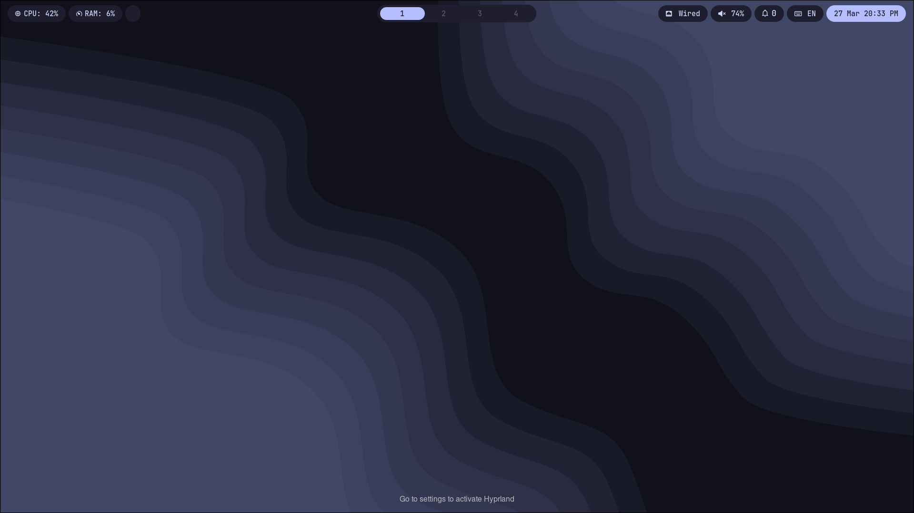
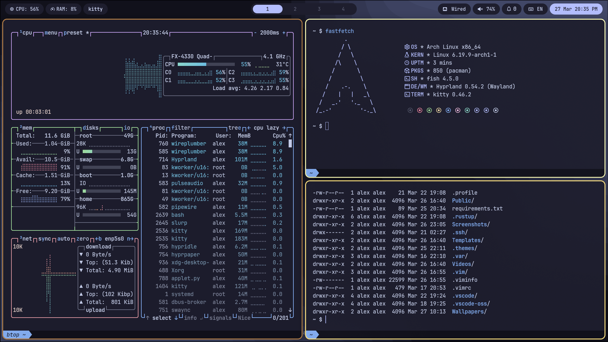

# Arch Dotfiles

  
  

> Minimal, modern Arch Linux environment built on Hyprland — engineered for clarity, consistency, and efficient daily use.

## Philosophy

This setup is driven by a simple constraint:

> Minimalism with intent.

The system removes visual and behavioral excess, prioritizing coherence, predictable interactions, and sustained usability. Every element is configured to stay out of the way while remaining functionally precise.

## Overview

A modular Hyprland configuration designed for a Wayland-first workflow, with emphasis on clean structure and modern ergonomics.

Core objectives:

- **Responsive interaction** — low overhead, immediate feedback
- **Consistent workflow** — uniform keybindings and layout logic
- **Focused environment** — minimal UI, reduced cognitive load
- **Practical baseline** — suitable for development, browsing, and media

## Features

- **Dynamic workspaces** with fluid transitions
- **Tiling-first layout** with optional floating control
- **Wayland-native stack** with minimal legacy dependencies
- **Unified theming** across all components
- **Lightweight and efficient** resource usage

## System Components & Applications

| Component | Software |
| --- | :---: |
| **Window Manager**          | Hyprland |
| **Bar**                     | Waybar |
| **Application Launcher**    | Wofi |
| **Notification Daemon**     | swaync |
| **Terminal Emulator**       | kitty + foot(alt) |
| **Shell**                   | fish shell |
| **Text Editor**             | Vim |
| **System resource monitor** | Btop |
| **File Manager**            | nautilus + yazi |
| **Fonts**                   | JetBrainsMono Nerd Font |
| **Cursor**                  | Bibata-Modern-Ice |
| **Lockscreen**              | Hyprlock |
| **Image Viewer**            | imv |
| **Media Player**            | vlc |
| **Music Player**            | vlc |
| **Screenshot Software**     | hyprshot |

## Keybinds

| Keymap | Descrition |
| --- | :---: |
| **SUPER + T** | Launch primary terminal (kitty) |
| **SUPER + ALT + T** | Launch alternative terminal (foot) |
| **SUPER + B** |  Launch default browser (Zen) |
| **SUPER + ALT + B** | Launch fallback browser (Firefox) |
| **SUPER + E** | Open file manager |
| **SUPER + O** | Open Obsidian |
| **SUPER + F** | Application launcher (wofi) |
| **SUPER + ALT + S** | Suspend system |
| **CTRL + ALT + E** | Safe exit (hyprshutdown fallback) |
| **SUPER + F11** | Toggle fullscreen |
| **SUPER + SPACE** | Toggle floating mode |
| **SUPER + C** | Close active window |
| **ALT + TAB** | Cycle through windows |
| **ALT + L** | Lock screen(require _**hyprlock**_) |
| **CTRL + TAB** | Switch keyboard layout |
| **SUPER + H** | Focus left |
| **SUPER + L** | Focus right |
| **SUPER + K** | Focus up |
| **SUPER + J** | Focus down |
| **SUPER + 1** | Switch to workspace 1 |
| **SUPER + 2** | Switch to workspace 2 |
| **SUPER + 3** | Switch to workspace 3 |
| **SUPER + 4** | Switch to workspace 4 |
| **ALT + 1** | Move window to workspace 1 |
| **ALT + 2** | Move window to workspace 2 |
| **ALT + 3** | Move window to workspace 3 |
| **ALT + 4** | Move window to workspace 4 |
| **PRINT** | Capture active window (require _**hyprshot**_) |
| **SHIFT + PRINT** | Capture selected region (require _**hyprshot**_) |
| **CTRL + PRINT** | Capture full monitor (require _**hyprshot**_) |

