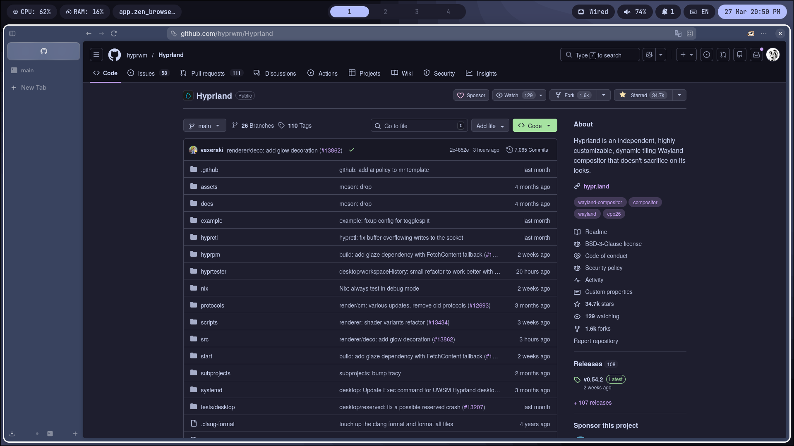

<div align="center">
  
# Hyprland Configuration

>My personal Arch Linux configuration is fully optimized for Hyprland, a modern and highly dynamic Wayland compositor. This configuration aims to create a fluid, responsive, and distraction-free desktop, optimized for coding, workflow management, and multimedia, while still being lightweight enough to run efficiently on modern hardware


</div>

## Philosophy
This configuration is designed around a simple idea:

> Speed, clarity, and control over everything else.

No unnecessary bloat, no overengineered visuals — just a responsive environment that stays out of your way while you work.

## Overview

This repository contains my custom **Hyprland** configuration — a modern, dynamic Wayland compositor setup built for:

- **Performance** — fast, responsive, no unnecessary overhead  
- **Focus** — clean UI, minimal distractions  
- **Productivity** — optimized keybindings and workflow  
- **Daily use** — development, browsing, and multimedia  

## Features

- **Dynamic workspaces** with smooth animations  
- **Custom keybindings** for navigation and window control  
- **Tiling + floating workflow** hybrid
- **Modular** configuration structure
- **Wayland-native stack** (Kitty, etc.)  
- **Clean** and **consistent** UI
- **Notification system** integration (swaync)

## Installation
### Requirements:

Before using this config, make sure you have:

- Arch Linux (or Arch-based distro)
- Hyprland (latest stable recommended)
- Wayland-compatible environment

### Core dependencies:
```shell
sudo pacman -Syu
# DONT USE pacman -Syu hyprland hypridle ...

sudo pacman -S \
hyprland wayland-protocols hypridle hyprlock hyprpaper waybar wofi \
kitty wl-clipboard foot swaync qt5ct qt6ct ttf-jetbrainsmono-nerd \
```

### Additional packages:
```shell
sudo pacman -S \
btop ufw brightnessctl flatpak xdg-desktop-portal xdg-desktop-portal-hyprland \
pipewire pipewire-pulse pipewire-alsa nautilus wget curl fish git base-devel \

# Setup yay(AUR):
cd ~
git clone https://aur.archlinux.org/yay.git
cd yay
makepkg -si

yay -S hyprshot
# Install a package from AUR: yay -S <package-name>
# Search AUR packages: yay -Ss <package-name>

# Add Flathub (main app source for flatpak):
sudo flatpak remote-add --if-not-exists flathub https://flathub.org/repo/flathub.flatpakrepo

# Search flatpak packaga at flathub: flatpak search zen
# Install the specific package from flathub: flatpak install app.zen_browser.zen
```

## Showcase




<div align="center">
  
## Contributing

Suggestions and improvements are welcome. Open an issue or PR
</div>
